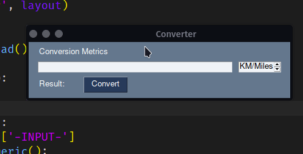

<h1 align="center">Welcome to pysimplegui 👋</h1>
<p>
  
  <a href="https://twitter.com/juam_sv" target="_blank">
    
  </a>
</p>

> Some projects and tests using python library pysimplegui

### 🏠 [Homepage](https://github.com/juam-sv/pysimplegui)



## Create and activate virtual enviroment 

```sh
python3 -m venv .venv
source .venv/bin/activate.fish
```

## Install

```sh
pip install -r requirements.txt
```

## Usage

```sh
python code.py
```

## Author

👤 **Juam S.**

* Website: https://github.com/juam-sv
* Twitter: [@juam_sv](https://twitter.com/juam_sv)
* Github: [@juam-sv](https://github.com/juam-sv)
* LinkedIn: [@juam-sv](https://linkedin.com/in/juam-sv)

## Show your support

Give a ⭐️ if this project helped you!

***
_This README was generated with ❤️ by [readme-md-generator](https://github.com/kefranabg/readme-md-generator)_
